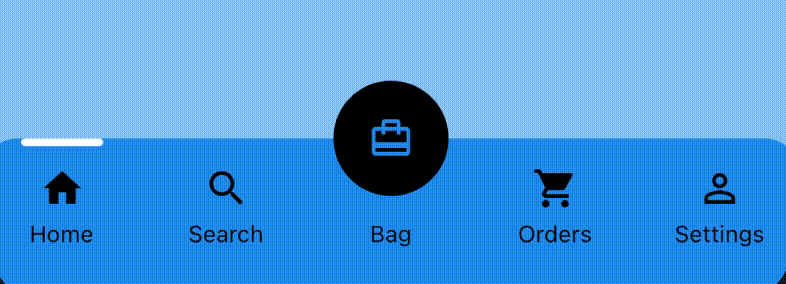

 <a href="https://github.com/Solido/awesome-flutter">
   
</a>

# Clean Bottom Navigation Bar

A clean and simple bottom navigation bar with smooth animation and Floating Action Button (FAB) added to the mix.

Check out the source code of the package in the [/lib](https://github.com/0x4d-sh/clean_bottom_navigation_bar/tree/main/lib) folder.

## Preview (default mode)



## Getting Started

### Add the plugin:
```yaml
dependencies:
  ...
  clean_bottom_navigation_bar: ^1.0.0
```

### Import the package
```Dart
import 'package:clean_bottom_navigation_bar/clean_bottom_navigation_bar.dart';
```

### Implementation
```Dart
bottomNavigationBar: CleanNavigationBar(
        showFab: true,
        barHeight: 60,
        fabHeight: -30,
        currentIndex: _currentIndex,
        activeColor: Theme.of(context).primaryColor,
        inactiveColor: Theme.of(context).cardColor,
        indicatorColor: Theme.of(context).indicatorColor,
        titleStyle: Theme.of(context)
            .textTheme
            .caption
            .merge(TextStyle(color: Theme.of(context).cardColor)),
        onTap: onTabTapped,
        items: [
          CleanNavigationBarItem(title: Text('Home'), icon: Icons.home),
          CleanNavigationBarItem(title: Text('Search'), icon: Icons.search),
          CleanNavigationBarItem(title: Text('Bag'), icon: Icons.card_travel),
          CleanNavigationBarItem(
              title: Text('Orders'), icon: Icons.shopping_cart),
          CleanNavigationBarItem(
              title: Text('Settings'), icon: Icons.person_outline),
        ],
      ),
```
For more information, please refer to the [example](https://github.com/0x4d-sh/clean_bottom_navigation_bar/tree/main/example) folder.

## Customization
The following variables have been set to allow configuration:

bool **showFab** - To show/hide Floating Action Button (FAB)
int  **fab** - Set which index/tab should the FAB be shown 
double **cornerRadius** - Set radius to add curves to the corner of the bottom navigation bar
double **barHeight** - Specify the bar height of the navigation bar
double **fabHeight** - Specify the offset of the FAB to keep inline with the navigation bar
double **indicatorHeight** - Set the height for indicator of active tab that is zooming left and right
Color **activeColor** - The primary colour for all icons and FAB 
Color **tabColor** - The background colour of the navigation bar for all tabs 
Color **indicatorColor** - The color of the indicator that is moving left and right
TextStyle **titleStyle** - To specify font, size and color of the text below icons

# Thank you
This package was developed with reference to [Pedromassango](https://github.com/pedromassango/titled_navigation_bar)'s Titled Navigation bar.